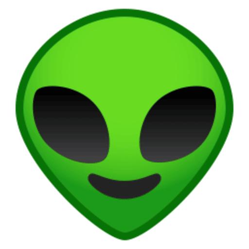

# 📱 The Next Planet APK

### Discover Unlimited Entertainment — All in One App

The **The Next Planet APK** brings your favorite entertainment together in one lightweight Android application. Discover trending movies, TV series, live TV, sports, anime, apps, and much more through a fast, modern, and user-friendly experience.

📥 **Official APK Download Website:** https://www.thenextworld.site

---

  

---

# ✨ Features

✅ Modern & Clean Interface

✅ Fast Content Discovery

✅ Lightweight APK

✅ Regular Updates

✅ Mobile Optimized

✅ Trending Movies & TV Shows

✅ Live TV & Sports

✅ Anime Collection

✅ Web Series

✅ Entertainment Apps

✅ Multiple Download Mirrors

---

# 📥 Download

| Source | Status |
|---------|--------|
| https://www.thenextworld.site/ | 🌍 Official Website |

---

# 🚀 Installation

1. Download the latest APK.
2. Enable **Install Unknown Apps** in your Android settings.
3. Open the downloaded APK.
4. Tap **Install**.
5. Launch **The Next Planet** and start exploring.

---

# 🎬 Explore

- 🎥 Movies
- 📺 TV Series
- 🎞️ Web Series
- ⚽ Live Sports
- 📡 Live TV
- 🍿 Trending Content
- ⭐ New Releases
- 🎌 Anime
- 📱 Android Apps

---

# 📱 Why Choose The Next Planet?

The internet has thousands of entertainment sources scattered across different websites.

The Next Planet simplifies discovery by bringing everything together in one convenient Android application, helping users quickly find trending and popular entertainment.

---

# ⚡ Performance

- Fast loading
- Smooth navigation
- Lightweight design
- Optimized for Android devices
- Regular improvements

---

# 🔒 Privacy

The app is designed to provide a simple and efficient browsing experience.

For additional online privacy, users may choose to use a trusted VPN while browsing the web.

---

# 🌎 Official Links

### TNP APK Download Website
https://www.thenextworld.site/

---

# 💡 Our Mission

Our goal is to make entertainment discovery simple, fast, and accessible.

The Next Planet continues to evolve with new features, improved performance, and regular updates for users around the world.

---

# ❤️ Support

If you enjoy using **The Next Planet APK**, please consider:

⭐ Starring this repository

🍴 Forking the project

📢 Sharing it with friends

🐞 Reporting issues

💬 Providing feedback

---

# 📄 Disclaimer

The Next Planet is intended to help users discover publicly available entertainment resources. Users are responsible for complying with the laws and regulations applicable in their own jurisdiction.

---

Made with ❤️ by <strong>The Next Planet</strong>

🌎 https://www.thenextworld.site/

